# Backdoor-Detection-using-EDR-SIEM

## Objective 
The objective of this project is to simulate a backdoor attack and detect it using EDR (LimaCharlie) and analyze it using SIEM (Splunk).

## Tools Used
 - LimaCharlie
 - Splunk
 - Kali Linux 
 - Windows VM
 - msfvenom

## Architecture 
The following diagram represents the attack and detection flow:
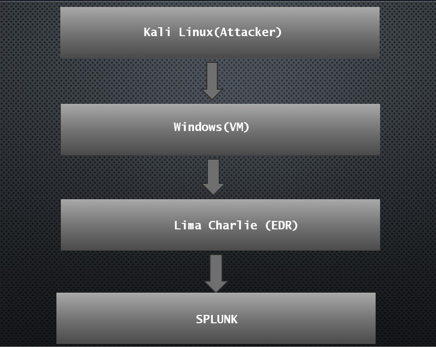            

## Attack Simulation

A backdoor attack was simulated by generating a malicious payload using msfvenom and executing it on a target Windows machine.

### Initial Access

The payload (`notmalware.exe`) was executed on the victim machine to simulate unauthorized access and establish an initial foothold.

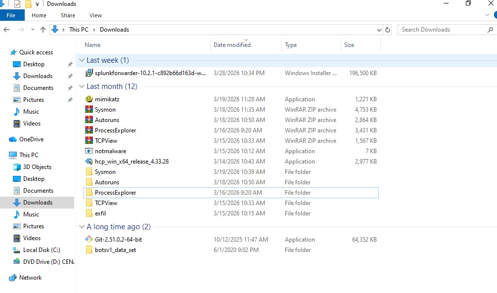

### Persistence Techniques

After gaining access, the attacker established persistence to maintain long-term access to the system. The following techniques were used:

- **Registry Run Key Modification** – Ensures the payload executes at system startup  
- **Scheduled Task Creation** – Triggers the payload at regular intervals  
- **Malicious Service Creation** – Runs the payload as a background service  

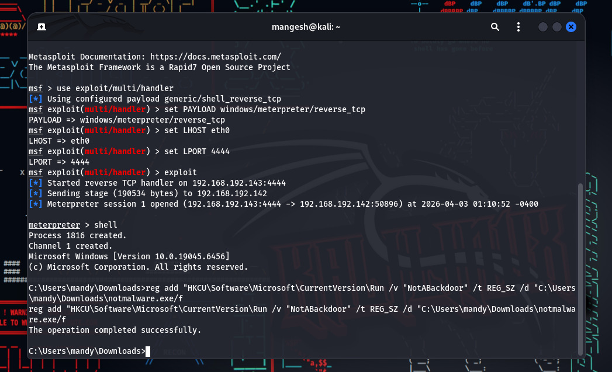

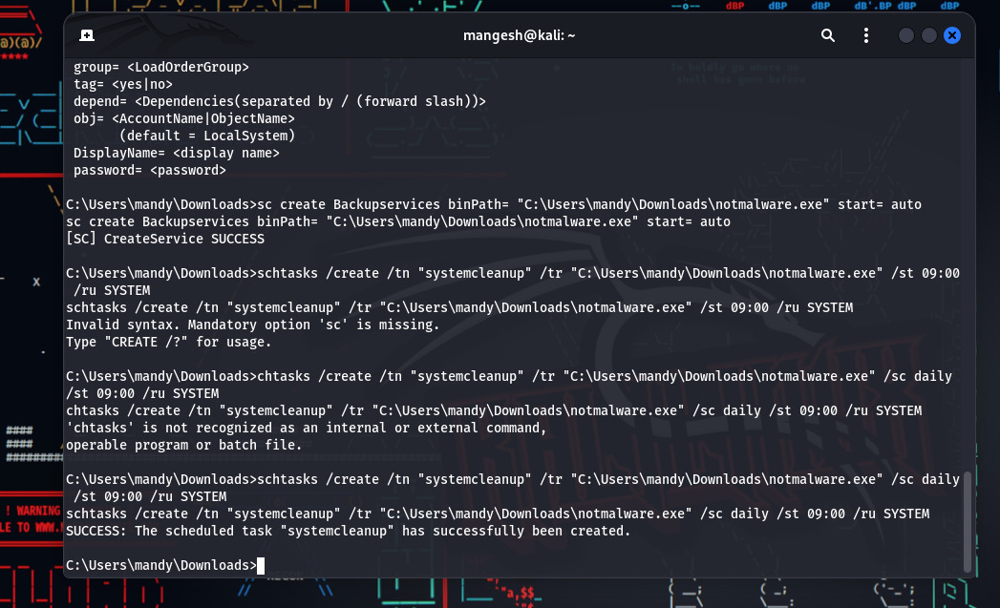

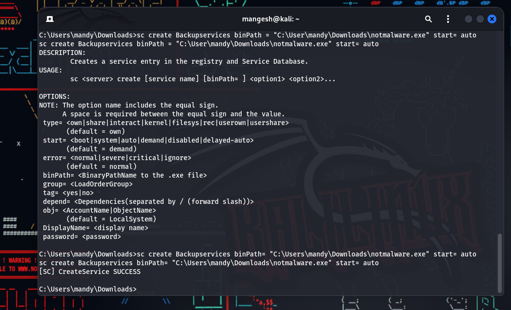

## Detection (EDR - LimaCharlie)

EDR telemetry from LimaCharlie was used to monitor and detect suspicious activities on the endpoint. The focus was on identifying abnormal process execution and persistence mechanisms associated with the backdoor.

### Detection Strategy

The detection approach was based on monitoring:

- Execution of suspicious executables (e.g., `notmalware.exe`)
- Processes running from unusual locations (e.g., AppData)
- Persistence-related activities such as registry modifications, scheduled tasks, and service creation

### Detection Rules

Custom detection rules were created in LimaCharlie to identify these behaviors. The rules focused on:

- Detecting execution of `notmalware.exe`
- Identifying processes running from the AppData directory
- Monitoring command-line activity for tools like `schtasks` and `sc`
- Detecting registry changes related to startup persistence

Detection rule files are available in the `rules/` directory.

### Alert Generation

When the payload was executed and persistence mechanisms were established, LimaCharlie successfully generated alerts based on the defined detection rules.

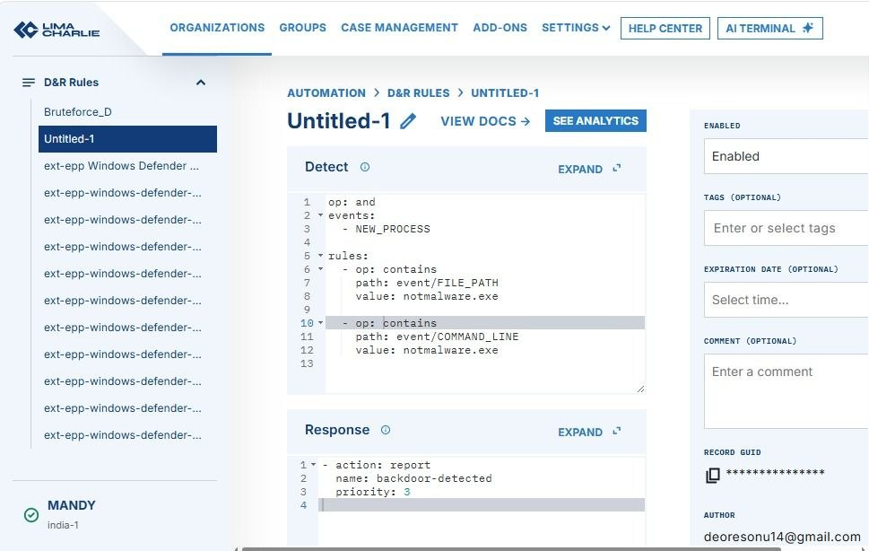

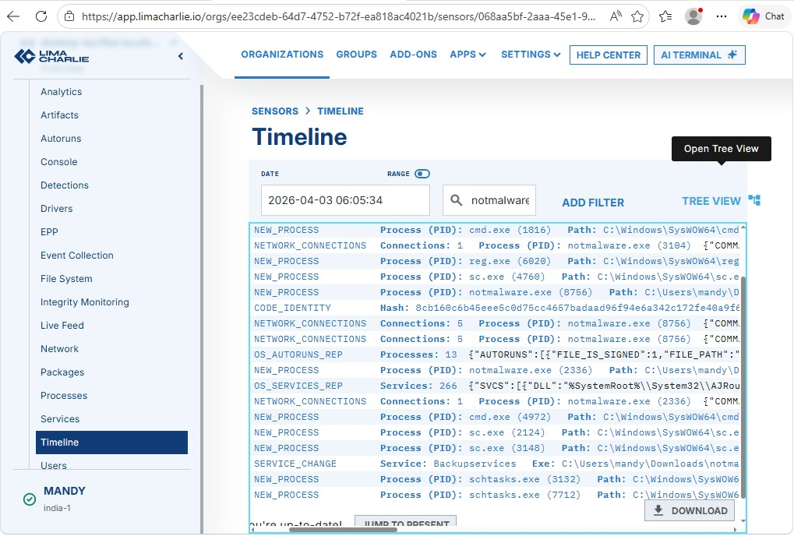

## SIEM Analysis (Splunk)

Logs collected from the endpoint were ingested into Splunk for further analysis and visualization of the attack activity.

### Log Analysis

The ingested logs were analyzed to identify indicators of compromise related to the backdoor execution and persistence mechanisms.

Key focus areas included:

- Execution of the malicious payload (`notmalware.exe`)
- Registry modifications for persistence
- Scheduled task creation using `schtasks`
- Service creation using `sc`

### Queries Used

The following queries were used to detect suspicious activities:

index=* notmalware.exe

index=* schtasks

index=* "sc create"

index=* CurrentVersion\\Run

## Results

The EDR solution (LimaCharlie) successfully detected the execution of the malicious payload and the persistence mechanisms established by the attacker.

Alerts were generated for suspicious activities such as:

- Execution of `notmalware.exe`
- Registry modifications for persistence
- Scheduled task creation
- Malicious service creation

Further analysis in Splunk confirmed these activities and provided clear visibility into the attack pattern through logs and visualizations.

## MITRE ATT&CK Mapping

### Execution
- Command and Scripting Interpreter (T1059)

### Persistence
- Registry Run Keys / Startup Folder (T1547.001)
- Scheduled Task (T1053)
- Create or Modify System Process (T1543)

## Investigation Summary

- A suspicious executable (`notmalware.exe`) was identified on the endpoint
- The process was executed from an uncommon location
- Multiple persistence mechanisms were established by the attacker
- EDR generated alerts for suspicious behavior
- SIEM analysis confirmed abnormal activity patterns
- The activity was classified as a potential backdoor attack

## Screenshots

## Screenshots

###  Architecture

###  Reverse Shell (Attacker Access)
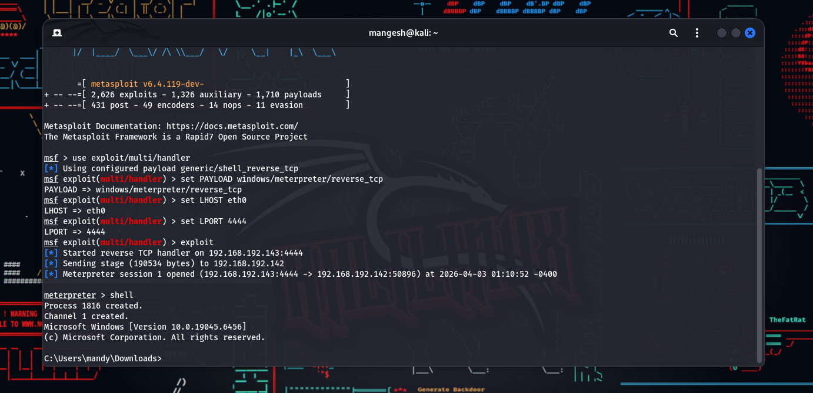

###  Backdoor Execution

###  Persistence - Registry

###  Persistence - Scheduled Task

###  Persistence - Service

###  Event Details (EDR)
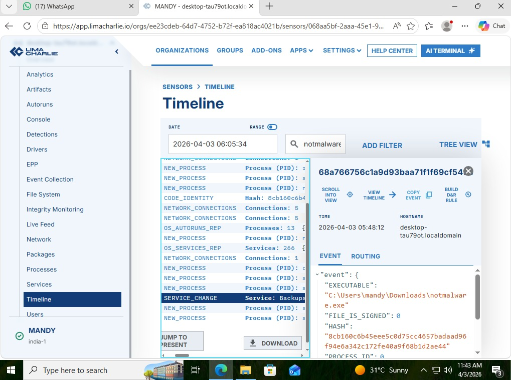

###  Detection Rule

###  Alerts Triggered

###  Splunk Log Analysis
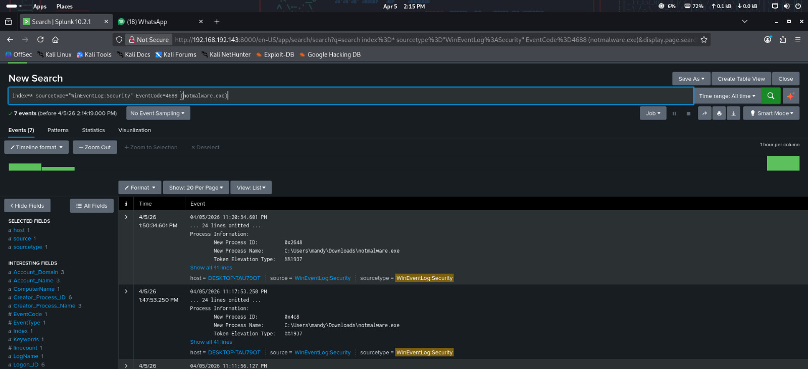

###  Dashboard Visualization
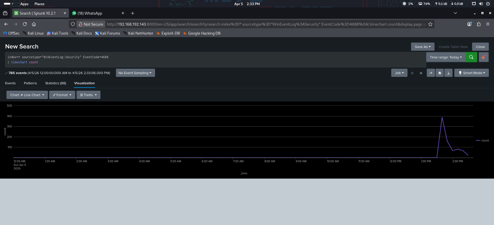

